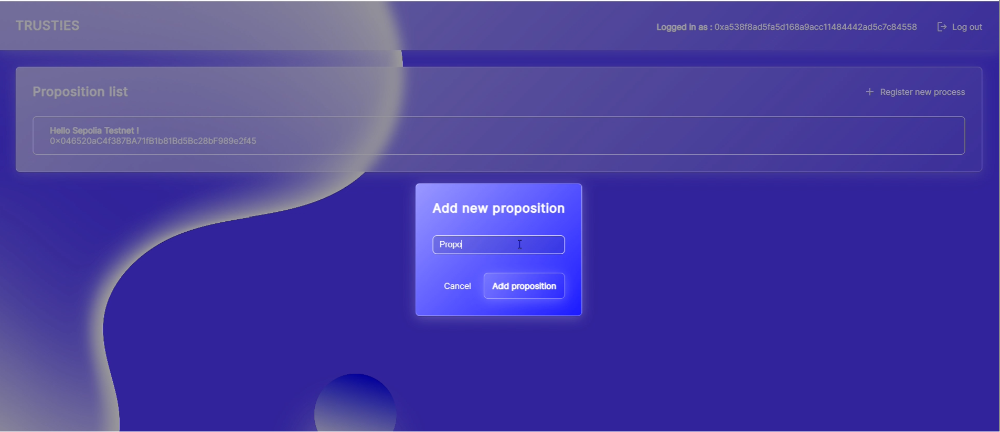
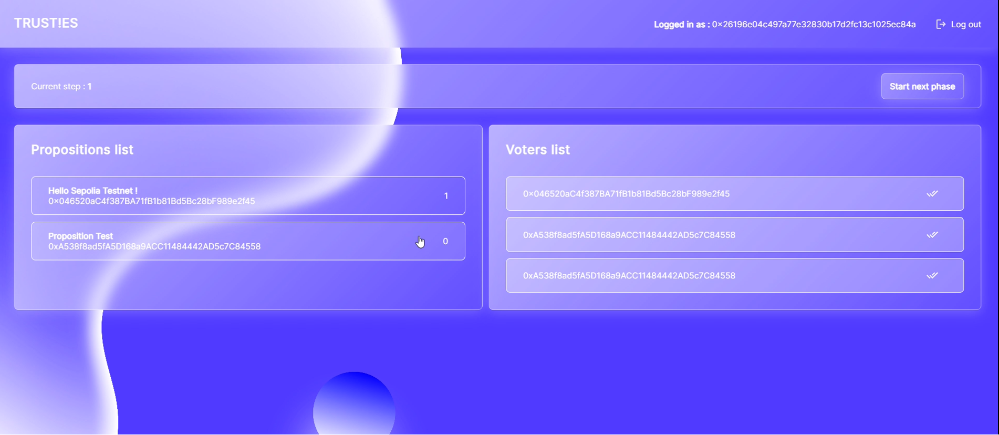

# [SCHOOL PROJECT]

`GILLOT Quentin / SALON Tom`

# Trust!es, dApp vote between friends -  ReactJs, Solidity

Ce projet vise à créer une DApp de vote transparente et sécurisée pour une petite organisation. Utilisez Solidity pour développer le smart contract "Voting" qui permettra l'enregistrement d'une liste blanche d'électeurs, la proposition d'idées, le vote et le décompte des résultats.

## Organisation du travail au sein du groupe

En raison de problèmes techniques sur l'un de nos ordinateurs, nous n'avions qu'un seul poste pour deux personnes. Nous avons donc travaillé en pair programming pendant toute la durée du projet. Chacun a pu apporter son expérience sur les deux parties de l'application : le contrat et le frontend.

Le développement du contrat a été rapide. Les principaux défis auxquels nous avons été confrontés étaient dus à notre connaissance (très) limitée de ReactJs. Beaucoup d'incompréhensions et de bugs très frustrants, compte tenu du peu de temps qui nous était imparti pour concevoir cette DApp. Néanmoins, nous avons persévéré et réussi à terminer le projet dans les temps.

## Lien vers les différentes ressources

* [Vidéo de démonstration](https://drive.google.com/file/d/1C2KGmxRyBXev66J7Lzl_ZT7CCYPzpSxU/view?usp=sharing)

* [App vercel](https://trusties.vercel.app/) pour jouer avec l'application. Quentin est l'admin du contrat.

* [Etherscan](https://sepolia.etherscan.io/address/0x7714c959Dc736cef0627f551F2AA6167798a1965) pour visualiser le contrat déployé sur le testnet sepolia.
